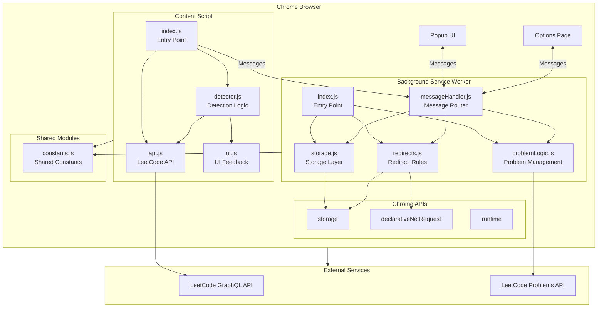
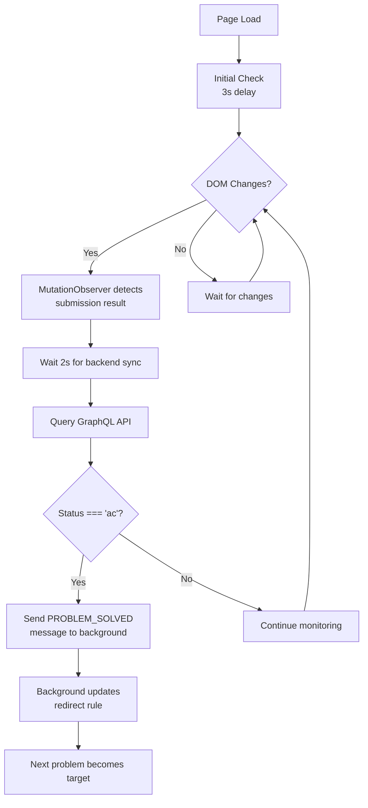
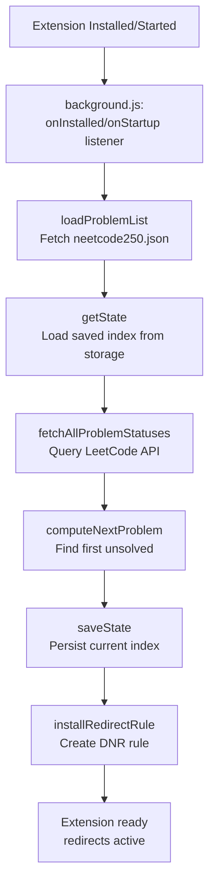
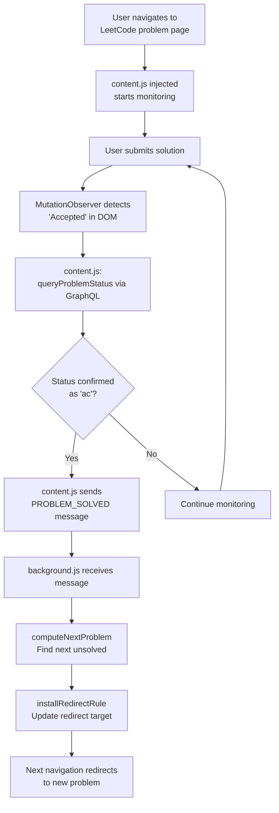

# Leetcode Buddy - Technical Architecture

This document provides a comprehensive technical explanation of how the Leetcode Buddy Chrome extension works, including its architecture, data flow, and implementation details.

## Table of Contents

1. [Overview](#overview)
2. [System Architecture](#system-architecture)
3. [Component Breakdown](#component-breakdown)
4. [Data Flow](#data-flow)
5. [API Integration](#api-integration)
6. [Storage Architecture](#storage-architecture)
7. [Redirect Mechanism](#redirect-mechanism)
8. [Problem Detection System](#problem-detection-system)
9. [Bypass System](#bypass-system)
10. [Message Passing](#message-passing)

## Overview

Leetcode Buddy is a Chrome Extension (Manifest V3) that helps enforce sequential completion of the NeetCode 250 problem list by:

1. **Blocking non-whitelisted websites** using Chrome's `declarativeNetRequest` API
2. **Redirecting users** to their current unsolved problem on LeetCode
3. **Auto-detecting solved problems** by monitoring LeetCode pages and querying their API
4. **Advancing automatically** to the next problem when the current one is solved
5. **Providing timed breaks** with cooldown periods to prevent abuse

## System Architecture

### High-Level Overview



## Component Breakdown

### 1. Manifest (`manifest.json`)

The manifest defines the extension's structure and permissions:

- **Manifest Version**: 3 (MV3) - Required for modern Chrome extensions
- **Permissions**:
  - `storage`: Access to Chrome storage APIs (sync and local)
  - `declarativeNetRequest`: Network request interception and redirection
  - `declarativeNetRequestFeedback`: Feedback on rule matches (optional)
- **Host Permissions**: `*://*/*` to intercept all navigation, plus specific domains
- **Background Service Worker**: Runs `background.js` as a persistent service worker
- **Content Scripts**: Injected into `https://leetcode.com/problems/*` pages
- **Action**: Defines the popup UI and extension icons

### 2. Background Service Worker (Modular)

The background service worker is split into 5 focused modules:

#### `src/background/index.js` - Entry Point

The main entry point that orchestrates initialization and lifecycle:

- Sets up event listeners (`onInstalled`, `onStartup`)
- Initializes problem set and aliases on startup
- Runs periodic checks (daily reset, redirect restoration)
- Coordinates between other modules

#### `src/background/storage.js` - Storage Layer

Handles all Chrome storage operations:

- **State Management**: `getState()`, `saveState()`
- **Daily Solve**: `getDailySolveState()`, `markDailySolve()`, `clearDailySolve()`
- **Bypass**: `getBypassState()`, `setBypassState()`, `clearBypass()`
- Abstracts `chrome.storage.sync` and `chrome.storage.local`

#### `src/background/problemLogic.js` - Problem Management

Manages problem sets, aliases, and progress:

1. **Problem Set Loading**
   - Loads `src/assets/data/neetcode250.json`
   - Caches problem set in memory
   - Organized by categories (18 categories)

2. **LeetCode API Integration**
   - Fetches all problem statuses: `fetchAllProblemStatuses()`
   - Builds status map (slug → "ac" | null)

3. **Next Problem Computation**
   - `computeNextProblem()`: Finds next unsolved problem
   - Iterates through categories and problems in order
   - Returns null when all problems solved

4. **Progress Calculation**
   - `computeCategoryProgress()`: Per-category progress
   - `getAllCategoryProgress()`: Overall progress across all categories

5. **Alias Resolution**
   - Loads `src/assets/data/problemAliases.json`
   - Maps alternative problem names to canonical slugs
   - Updates storage with current index and solved problems set

4. **Redirect Rule Management**
   - Creates/updates a dynamic `declarativeNetRequest` rule
   - Rule redirects all non-whitelisted main_frame requests
   - Updates redirect target when problem advances

5. **Bypass System**
   - Manages timed bypass periods (10 minutes)
   - Enforces cooldown periods (30 minutes)
   - Temporarily removes redirect rule during bypass

6. **Message Handling**
   - Listens for messages from content script and popup
   - Handles: `PROBLEM_SOLVED`, `GET_STATUS`, `ACTIVATE_BYPASS`, `REFRESH_STATUS`

#### Key Functions:

```javascript
// Core functions in background.js
loadProblemList()           // Loads neetcode250.json
getState()                  // Retrieves current state from storage
saveState()                 // Persists state to storage
getBypassState()            // Checks bypass status and timers
activateBypass()            // Activates 10-minute bypass
fetchAllProblemStatuses()   // Bulk fetch from LeetCode API
computeNextProblem()        // Determines next unsolved problem
installRedirectRule()       // Creates/updates DNR redirect rule
removeRedirectRule()        // Removes redirect rule (for bypass)
checkBypassExpiration()     // Periodic check to restore redirect
```

### 3. Content Script (`content.js`)

Runs only on `https://leetcode.com/problems/*` pages. Its purpose is to detect when a problem is solved.

#### Detection Mechanisms:

1. **DOM Mutation Observer**
   - Watches for submission result elements
   - Looks for `[data-e2e-locator="submission-result"]` elements
   - Checks for "Accepted" or "Success" text

2. **URL Change Detection**
   - Monitors `window.location.pathname` for client-side navigation
   - Re-checks status when navigating to a new problem

3. **Visibility Change Listener**
   - Re-checks status when tab becomes visible
   - Handles cases where user switches tabs during submission

4. **GraphQL Status Query**
   - Queries LeetCode's GraphQL API for authoritative status
   - Uses CSRF token from cookies for authentication
   - Sends `PROBLEM_SOLVED` message to background when status === "ac"

#### Detection Flow:



### 4. Popup UI (`popup.html`, `popup.js`, `popup.css`)

The popup provides user interface and controls:

#### Features:

1. **Progress Display**
   - Visual progress bar (X/250 problems solved)
   - Current problem name and direct link
   - Real-time status updates

2. **Bypass Controls**
   - "Take a Break" button (10 minutes)
   - Countdown timer during active bypass
   - Cooldown timer showing when next bypass is available

3. **Status Refresh**
   - Manual refresh button to force API sync
   - Useful if problems solved outside extension

#### Update Cycle:

- Initial load: Fetches status via `GET_STATUS` message
- Auto-refresh: Every 30 seconds
- Bypass timer: Updates every 1 second when active
- Cooldown timer: Updates every 1 second when on cooldown

### 5. Problem List (`neetcode250.json`)

A static JSON array containing 250 LeetCode problem slugs in the exact order they should be completed:

```json
[
  "two-sum",
  "valid-anagram",
  "contains-duplicate",
  ...
]
```

Each slug corresponds to a LeetCode problem URL: `https://leetcode.com/problems/{slug}/`

## Data Flow

### Initialization Flow



### Problem Solving Flow



### Navigation Interception Flow

```mermaid
flowchart TD
    A[User navigates to any URL] --> B[Chrome checks<br/>declarativeNetRequest rules]
    B --> C{Rule matches?<br/>urlFilter='|http'<br/>resourceTypes=['main_frame']}
    C -->|No| D[Allow request]
    C -->|Yes| E[Check excludedRequestDomains<br/>whitelist]
    E --> F{Is whitelisted?}
    F -->|Yes| D
    F -->|No| G[Redirect to current<br/>problem URL]
    G --> H[User lands on<br/>LeetCode problem page]
```

## API Integration

### LeetCode GraphQL API

**Endpoint**: `https://leetcode.com/graphql`

**Query**:
```graphql
query questionStatus($titleSlug: String!) {
  question(titleSlug: $titleSlug) {
    status
  }
}
```

**Response**:
```json
{
  "data": {
    "question": {
      "status": "ac"  // or null, "notac", etc.
    }
  }
}
```

**Authentication**: Uses session cookies automatically (via `credentials: "include"`). Requires CSRF token in headers for POST requests.

**Usage**: Called by `content.js` to verify problem solve status after detecting a successful submission.

### LeetCode Problems API

**Endpoint**: `https://leetcode.com/api/problems/all/`

**Response Structure**:
```json
{
  "stat_status_pairs": [
    {
      "stat": {
        "question__title_slug": "two-sum"
      },
      "status": "ac"  // or null
    },
    ...
  ]
}
```

**Authentication**: Uses session cookies automatically.

**Usage**: Called by `background.js` to bulk-fetch all problem statuses. More efficient than querying each problem individually.

## Storage Architecture

### Chrome Storage Sync

**Purpose**: Syncs across devices, persists user progress.

**Data Structure**:
```javascript
{
  currentIndex: 42,                    // Current position in neetcode250.json
  solvedProblems: [                    // Array of solved problem slugs
    "two-sum",
    "valid-anagram",
    ...
  ]
}
```

**Operations**:
- Read: `chrome.storage.sync.get(['currentIndex', 'solvedProblems'])`
- Write: `chrome.storage.sync.set({ currentIndex, solvedProblems })`

**Limitations**: 
- 100KB quota per extension
- Syncs across Chrome instances (if user is signed in)

### Chrome Storage Local

**Purpose**: Local-only storage for bypass state (not synced).

**Data Structure**:
```javascript
{
  bypassUntil: 1234567890000,         // Timestamp when bypass expires
  nextBypassAllowed: 1234567890000    // Timestamp when next bypass allowed
}
```

**Operations**:
- Read: `chrome.storage.local.get(['bypassUntil', 'nextBypassAllowed'])`
- Write: `chrome.storage.local.set({ bypassUntil, nextBypassAllowed })`

**Why Local?**: Bypass state is device-specific and shouldn't sync. If you activate bypass on one device, it shouldn't affect others.

## Redirect Mechanism

### DeclarativeNetRequest (DNR) API

Chrome's MV3 replacement for the blocking `webRequest` API. Provides better performance and privacy.

### Rule Structure

```javascript
{
  id: 1000,                              // Unique rule ID
  priority: 1,                           // Higher priority wins
  action: {
    type: "redirect",
    redirect: { url: "https://leetcode.com/problems/two-sum/" }
  },
  condition: {
    urlFilter: "|http",                  // Matches http:// and https://
    resourceTypes: ["main_frame"],       // Only top-level navigation
    excludedRequestDomains: [             // Whitelist domains
      "leetcode.com",
      "neetcode.io",
      "chatgpt.com"
    ]
  }
}
```

### Rule Lifecycle

1. **Installation**: `chrome.declarativeNetRequest.updateDynamicRules({ addRules: [rule] })`
2. **Update**: Remove old rule, add new rule with updated URL
3. **Removal**: `chrome.declarativeNetRequest.updateDynamicRules({ removeRuleIds: [1000] })`

### How It Works

- Chrome evaluates DNR rules **before** making network requests
- Rules are matched in priority order
- `excludedRequestDomains` takes precedence - whitelisted domains bypass the redirect
- Only `main_frame` requests are intercepted (not subresources like images, scripts)

## Problem Detection System

### Multi-Layer Detection

The extension uses multiple detection mechanisms to ensure reliable problem solve detection:

#### Layer 1: DOM Observation

```javascript
// MutationObserver watches for submission results
const observer = new MutationObserver((mutations) => {
  const successElements = document.querySelectorAll('[data-e2e-locator="submission-result"]');
  // Check for "Accepted" text
});
```

**Pros**: Fast, immediate detection
**Cons**: DOM structure can change, may have false positives

#### Layer 2: GraphQL Verification

```javascript
// Query LeetCode's API for authoritative status
const status = await queryProblemStatus(slug);
if (status === 'ac') {
  // Problem is definitely solved
}
```

**Pros**: Authoritative source, reliable
**Cons**: Requires network request, slight delay

#### Layer 3: Periodic Checks

- Initial check after 3 seconds (page load)
- Re-check on URL change (client-side navigation)
- Re-check on tab visibility change
- Re-check every 30 seconds in popup

**Purpose**: Handles edge cases like:
- User solves problem in another tab
- User solves problem, then navigates away and back
- API lag between submission and status update

## Bypass System

### Design Goals

1. **Prevent Abuse**: Cooldown period prevents constant bypassing
2. **User Flexibility**: Allow legitimate breaks (bathroom, meals, etc.)
3. **Automatic Restoration**: Redirect resumes automatically after timeout

### Implementation

#### Bypass Activation

```javascript
// User clicks "Take a Break" in popup
activateBypass() {
  // Check cooldown
  if (now < nextBypassAllowed) {
    return { success: false, reason: "cooldown" };
  }
  
  // Set bypass expiration (10 minutes from now)
  bypassUntil = now + 10 * 60 * 1000;
  
  // Set next bypass allowed (30 minutes after bypass ends)
  nextBypassAllowed = bypassUntil + 30 * 60 * 1000;
  
  // Remove redirect rule
  removeRedirectRule();
}
```

#### Bypass Expiration Check

```javascript
// Runs every 60 seconds
checkBypassExpiration() {
  if (now >= bypassUntil) {
    // Bypass expired, restore redirect
    installRedirectRule();
  }
}
```

#### State Management

- **Active Bypass**: `now < bypassUntil` → Redirect rule removed
- **Cooldown**: `now < nextBypassAllowed` → Button disabled, shows countdown
- **Available**: `now >= nextBypassAllowed` → Button enabled

## Message Passing

### Communication Patterns

The extension uses Chrome's message passing API for communication between components:

#### Content Script → Background

```javascript
// content.js
chrome.runtime.sendMessage({
  type: 'PROBLEM_SOLVED',
  slug: 'two-sum'
});

// background.js
chrome.runtime.onMessage.addListener((message, sender, sendResponse) => {
  if (message.type === 'PROBLEM_SOLVED') {
    // Handle problem solved
    sendResponse({ success: true });
  }
});
```

#### Popup → Background

```javascript
// popup.js
chrome.runtime.sendMessage({ type: 'GET_STATUS' }, (response) => {
  // Update UI with response
});

// background.js
if (message.type === 'GET_STATUS') {
  sendResponse({
    success: true,
    currentSlug: problemSlugs[currentIndex],
    solvedCount: solvedProblems.size,
    bypass: bypassState
  });
}
```

### Message Types

1. **`PROBLEM_SOLVED`**: Content script notifies background that a problem was solved
2. **`GET_STATUS`**: Popup requests current status (problem, progress, bypass state)
3. **`ACTIVATE_BYPASS`**: Popup requests bypass activation
4. **`REFRESH_STATUS`**: Popup requests forced status refresh from LeetCode API

### Async Response Pattern

```javascript
chrome.runtime.onMessage.addListener((message, sender, sendResponse) => {
  (async () => {
    // Async operations
    const result = await someAsyncFunction();
    sendResponse(result);
  })();
  
  return true; // Keep message channel open for async response
});
```

**Important**: Must return `true` to keep the message channel open for async responses.

## Error Handling

### API Failures

- **GraphQL Query Fails**: Returns `null`, extension continues with last known state
- **Problems API Fails**: Falls back to stored state, redirects to last known problem
- **Network Errors**: Logged to console, extension remains functional

### Storage Failures

- **Sync Storage Full**: Falls back to local storage
- **Storage Unavailable**: Extension continues with in-memory state

### Rule Installation Failures

- **Rule Limit Exceeded**: Chrome allows up to 30,000 dynamic rules (we use 1)
- **Invalid Rule**: Logged to console, extension continues without redirect

## Performance Considerations

### Optimization Strategies

1. **Problem List Caching**: Loaded once, cached in memory
2. **Bulk API Calls**: Single call to fetch all problem statuses
3. **Debounced Checks**: Status checks delayed to avoid excessive API calls
4. **Efficient Storage**: Only stores necessary data (index + solved set)

### Resource Usage

- **Memory**: ~1MB (problem list + state)
- **Network**: ~1 API call per minute (status refresh) + GraphQL queries on solve
- **CPU**: Minimal (mostly event-driven)

## Security Considerations

### Permissions

- **Host Permissions**: `*://*/*` is necessary for redirect functionality but is a broad permission
- **Storage**: Only stores problem slugs and timestamps (no sensitive data)
- **API Calls**: Uses existing LeetCode session cookies (no credential storage)

### Privacy

- **No Data Collection**: Extension doesn't collect or transmit user data
- **Local Processing**: All logic runs locally, only queries LeetCode API
- **No Tracking**: No analytics or tracking code

## Future Enhancements

Potential improvements:

1. **Offline Support**: Cache problem statuses for offline checking
2. **Multiple Problem Lists**: Support custom problem lists
3. **Statistics Dashboard**: Track solve times, difficulty distribution
4. **Notifications**: Browser notifications when problem is solved
5. **Streak Tracking**: Track daily solve streaks
6. **Problem Recommendations**: Suggest similar problems

## Troubleshooting Guide

### Common Issues

1. **Redirect Not Working**
   - Check extension is enabled
   - Verify logged into LeetCode
   - Check browser console for errors
   - Try "Refresh Status" in popup

2. **Problem Not Advancing**
   - Ensure submission is marked "Accepted" on LeetCode
   - Wait 5-10 seconds for API sync
   - Check content script console for errors
   - Manually refresh status

3. **Bypass Not Working**
   - Check cooldown timer
   - Verify bypass state in storage
   - Check background service worker console

4. **API Errors**
   - Verify LeetCode login status
   - Check network connectivity
   - LeetCode API may be down (rare)

## Conclusion

Leetcode Buddy is a well-architected Chrome extension that leverages modern web APIs to create a focused learning environment. Its multi-layered detection system, efficient storage, and user-friendly bypass mechanism make it both effective and practical for helping enforce sequential problem-solving.

The extension demonstrates:
- Proper use of Chrome Extension Manifest V3 APIs
- Efficient API integration with external services
- Robust error handling and edge case management
- Clean separation of concerns (background, content, popup)
- User experience considerations (bypass system, progress tracking)

